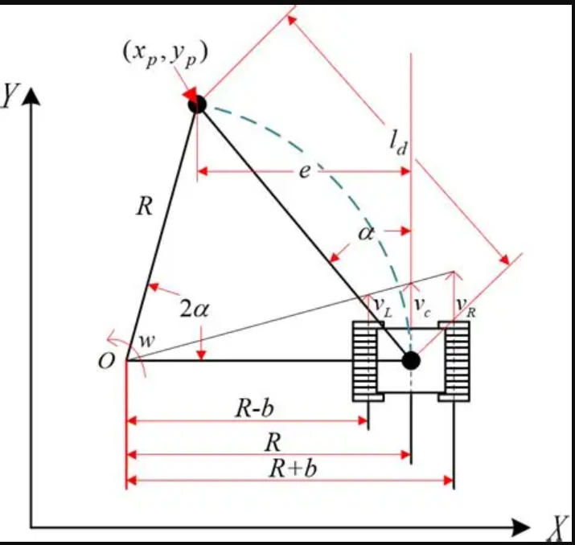
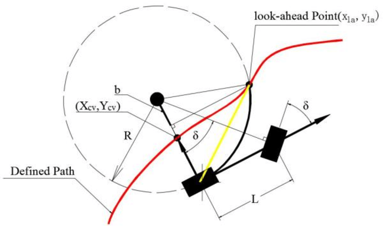
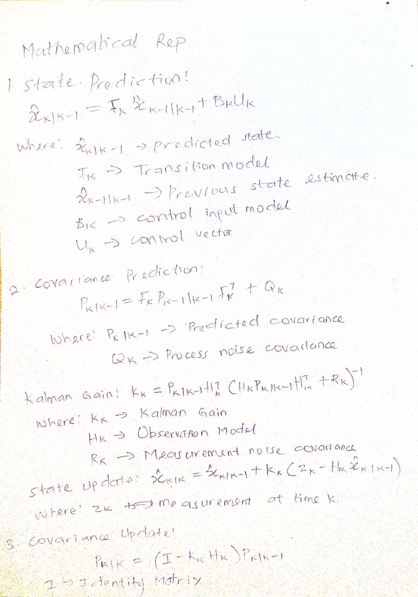
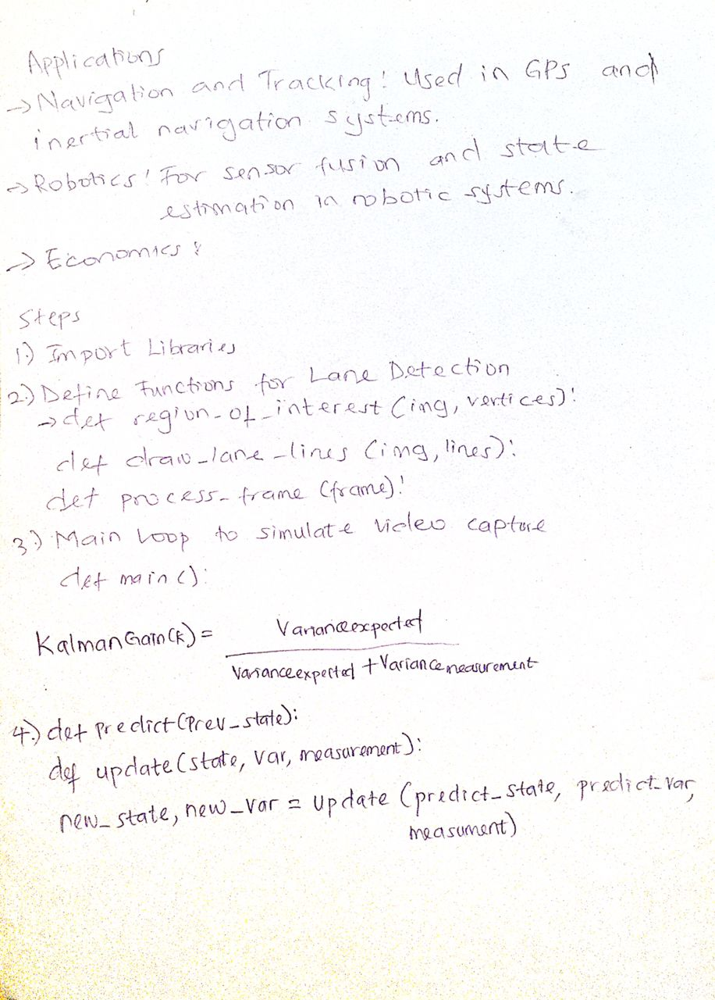
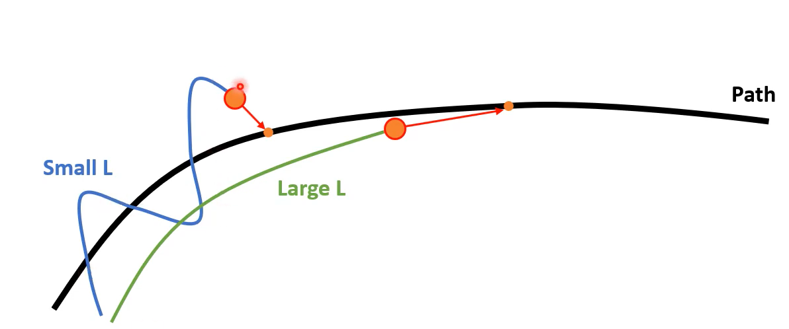
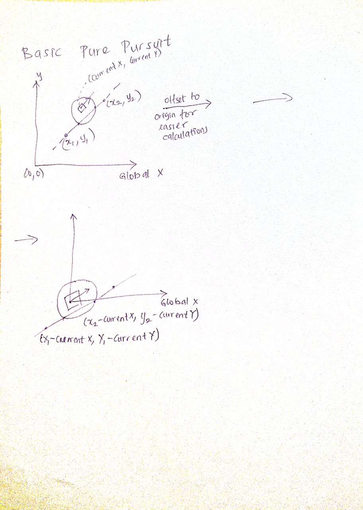
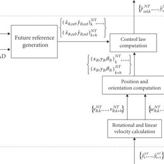

# README for Pure Pursuit Controller Implementation


## Motion Planning
The motion planning for a robot using the pure pursuit controller involves defining a path that the robot will follow. This path is typically represented as a series of waypoints or line segments. The robot uses these waypoints to determine its trajectory and adjust its steering accordingly. The key aspect of motion planning is to ensure that the path is feasible and allows the robot to navigate effectively through its environment.



## Radius of Curvature
The radius of curvature is a critical parameter in the pure pursuit controller. It determines how sharply the robot can turn while following a path. The radius is calculated based on the look-ahead distance and the turn error. A smaller radius indicates a sharper turn, while a larger radius indicates a gentler turn. The formula for the radius of curvature \( R \) is given by:


$$
R = \frac{look\_ahead\_distance}{2 \sin(turn\_error)}
$$

This relationship helps in adjusting the robot's speed and steering angle to maintain a smooth trajectory.


## Path Planning
Path planning involves generating a series of waypoints that the robot will follow. These waypoints are computed based on the desired trajectory and the robot's kinematic constraints. The path should be designed to minimize sharp turns and ensure that the robot can navigate through obstacles effectively. The pure pursuit controller uses these waypoints to calculate the goal point that the robot should aim for at any given time.




## Kalman Gain for State Estimation
The Kalman Filter is a powerful algorithm used for state estimation in robotics. It helps to reduce noise in sensor measurements and provides a more accurate estimate of the robot's position and velocity. The Kalman Gain \( K \) is computed as follows:

$$
K = \frac{variance_{expected}}{variance_{expected} + variance_{measurement}}
$$




This gain determines how much weight is given to the predicted state versus the measured state. A higher Kalman Gain indicates more trust in the measurement, while a lower gain indicates more trust in the prediction.

## Tune PID
Tuning the PID controller is essential for achieving smooth and responsive control in the robot's movements. The PID controller consists of three components: Proportional (P), Integral (I), and Derivative (D). Each component plays a specific role:


- **Proportional (P)**: Controls the immediate response to the error. A larger \( K_p \) results in a more aggressive response, making the robot correct deviations quickly. However, if set too high, it can lead to overshooting the target.

- **Integral (I)**: Addresses accumulated past errors. A larger \( K_i \) helps eliminate steady-state error by integrating the error over time. This is useful for ensuring the robot reaches its target position accurately. However, too high a value can cause oscillations and instability.

- **Derivative (D)**: Predicts future errors based on the rate of change. A larger \( K_d \) dampens the response and helps prevent overshooting by reacting to the speed of error changes. This component is crucial for stabilizing the control system, especially when approaching the target.

### Tuning the Look-Ahead Distance (L)
The look-ahead distance \( L \) is another crucial parameter that affects the performance of the pure pursuit controller:

- **Smaller L**: Leads to more aggressive maneuvering as the robot follows a closer arc. This can help the robot make sharper turns but may work against the dynamic limits of the vehicle, potentially causing instability.
- **Larger L**: Results in a smoother trajectory but can introduce higher tracking errors. This may lead to close approaches to obstacles, as the robot may not adjust its path quickly enough to avoid them.



The concept of tuning the look-ahead distance was discovered by Craig Coulter in 1992 for use in autonomous vehicles and robots. It emphasizes the balance between responsiveness and stability in navigating paths.

### Basic Pure Pursuit: What to Know Before Trying to Implement the Pure Pursuit Controller.
Before implementing the pure pursuit controller, ensure you have the following knowledge and tools:

- **Working knowledge of feedback control loops** such as PID.
- **A functioning Position Tracking (odometry) system** to determine the robot's position accurately.
- **Basic programming knowledge** in arrays and loops to implement the control algorithms.
- **High school level math** such as trigonometry to understand the geometric calculations involved.





## Important Notes
If you have any comments or suggestions, encountered issues with the code, or have questions about this document, reach out to us on our GitHub Support Page

### Additional Information
For those interested in experimenting with the pure pursuit controller, this is a good starter pack

## Import Necessary Libraries
To get started with the implementation, make sure to import the necessary libraries:

```python
import numpy as np
import matplotlib.pyplot as plt
import math
import matplotlib.animation as animation
from IPython import display
```

## Helper Functions for Graphing
Below are some helper functions to visualize the output of the pure pursuit controller and path generator. Feel free to modify these functions to graph lines in the style you prefer.

Reference url: https://thomasfermi.github.io/Algorithms-for-Automated-Driving/Control/PurePursuit.html

```python
def add_line(path):
    for i in range(0, len(path)):
        plt.plot(path[i][0], path[i][1], '.', color='red', markersize=10)
    
    for i in range(0, len(path)-1):
        plt.plot([path[i][0], path[i+1][0]], [path[i][1], path[i+1][1]], color='b')
        
    plt.axis('scaled')

def add_complicated_line(path, lineStyle, lineColor, lineLabel):
    for i in range(0, len(path)):
        plt.plot(path[i][0], path[i][1], '.', color='red', markersize=10)
        
    for i in range(0, len(path)-1):
        if i == 0:
            plt.plot([path[i][0], path[i+1][0]], [path[i][1], path[i+1][1]], lineStyle, color=lineColor, label=lineLabel)    
        else:
            plt.plot([path[i][0], path[i+1][0]], [path[i][1], path[i+1][1]], lineStyle, color=lineColor)
            
    plt.axis('scaled')

def highlight_points(points, pointColor):
    for point in points:
        plt.plot(point[0], point[1], '.', color=pointColor, markersize=10)

def draw_circle(x, y, r, circleColor):
    xs = []
    ys = []
    angles = np.arange(0, 2.2*np.pi, 0.2)        
    
    for angle in angles:
        xs.append(r * np.cos(angle) + x)
        ys.append(r * np.sin(angle) + y)
        
    plt.plot(xs, ys, '-', color=circleColor)
```

## Conclusion
This document serves as a comprehensive guide to implementing the pure pursuit controller for robotic motion planning. By understanding the principles of motion planning, radius of curvature, path planning, Kalman gain for state estimation, PID tuning, and the impact of the look-ahead distance, you can effectively develop a robust navigation system for your robot.